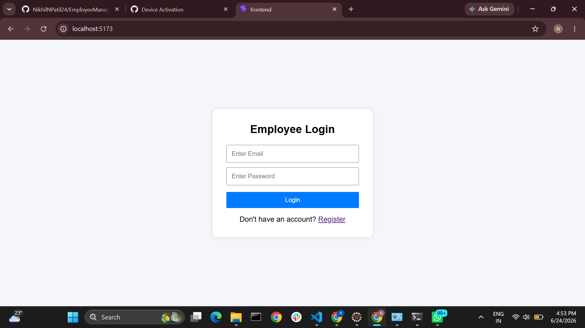
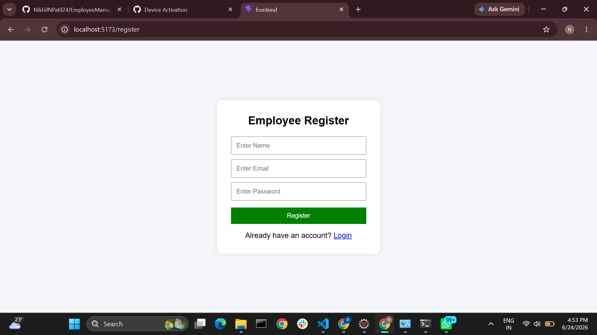
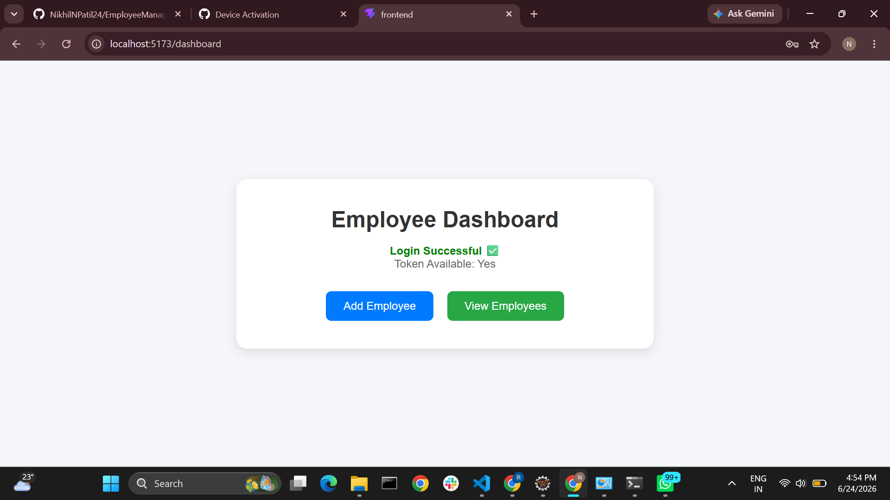
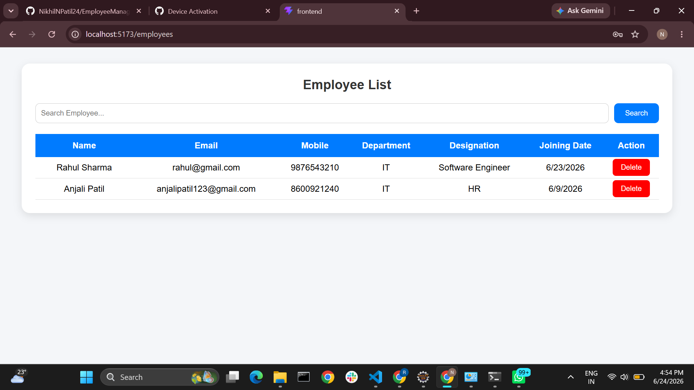
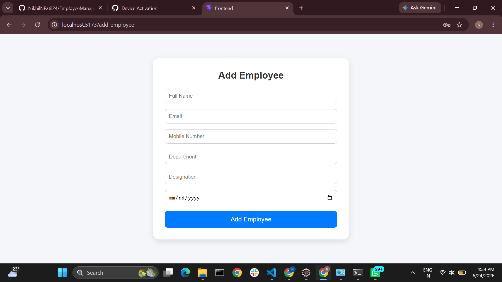

# Employee Management System

A Full Stack MERN (MongoDB, Express.js, React.js, Node.js) application for managing employee records with secure JWT Authentication and CRUD operations.

---

## Features

✅ User Registration

✅ User Login

✅ JWT Authentication

✅ Protected Routes

✅ Add Employee

✅ View Employee List

✅ Search Employee

✅ Delete Employee

✅ MongoDB Atlas Integration

✅ Responsive UI

---

## Tech Stack

### Frontend

- React.js
- React Router DOM
- Axios
- Vite

### Backend

- Node.js
- Express.js
- JWT
- bcryptjs

### Database

- MongoDB Atlas
- Mongoose

---

## Project Structure

```bash
EmployeeManagementSystem
│
├── backend
│   ├── config
│   ├── controllers
│   ├── middleware
│   ├── models
│   ├── routes
│   ├── .env
│   └── server.js
│
├── frontend
│   ├── src
│   │   ├── pages
│   │   ├── services
│   │   ├── App.jsx
│   │   └── main.jsx
│   └── package.json
│
└── README.md
```

---

## Screenshots

### Login Page



---

### Register Page



---

### Dashboard



---

### Employee List



---

### Add Employee Form



---

## Installation

### Clone Repository

```bash
git clone https://github.com/NikhilNPatil24/EmployeeManagementSystem.git
```

### Backend Setup

```bash
cd backend
npm install
npm run dev
```

### Frontend Setup

```bash
cd frontend
npm install
npm run dev
```

---

## Environment Variables

Create a `.env` file inside backend folder.

```env
MONGO_URI=your_mongodb_atlas_connection_string
JWT_SECRET=your_secret_key
PORT=5000
```

---

## API Endpoints

### Authentication

```http
POST /api/auth/register
POST /api/auth/login
```

### Employees

```http
GET    /api/employees
POST   /api/employees
DELETE /api/employees/:id
```

---

## Database

MongoDB Atlas is used as the cloud database service.

Collections:

- users
- employees

---

## Future Enhancements

- Update Employee
- Employee Profile Page
- Pagination
- Role Based Access
- Export Employee Data
- Dashboard Analytics

---

## Author

**Nikhil Patil**


---

## Project Status

🚀 Completed and Working Successfully
